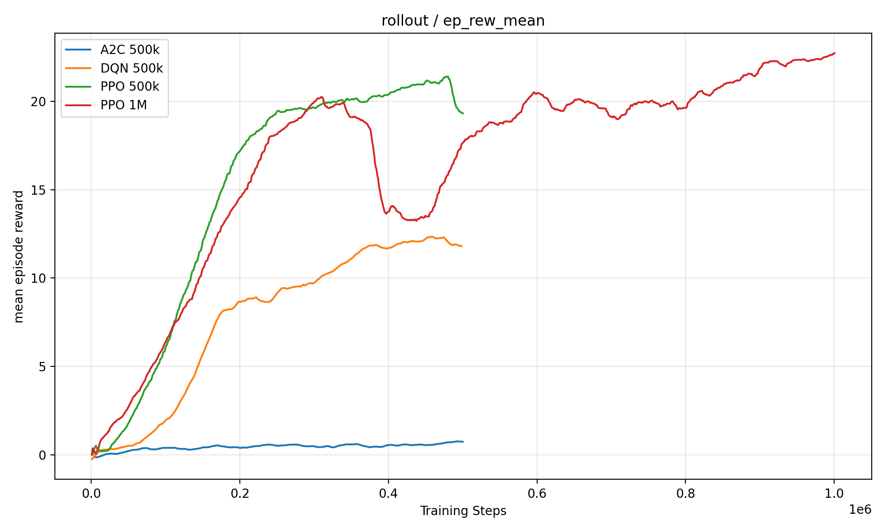
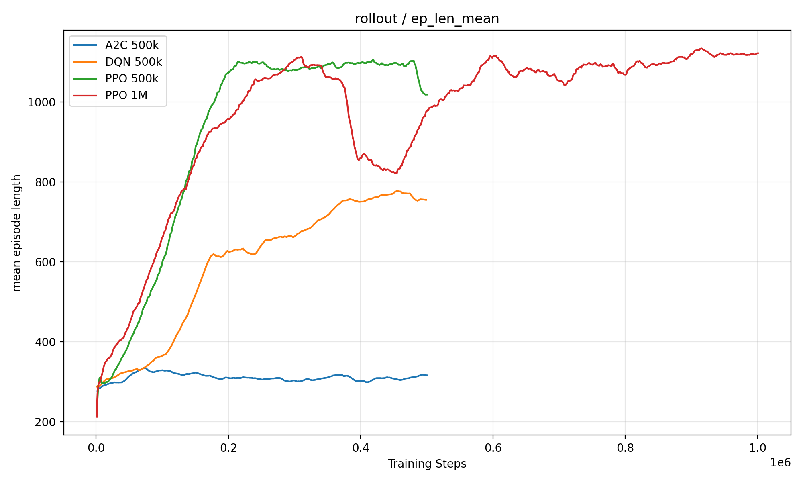
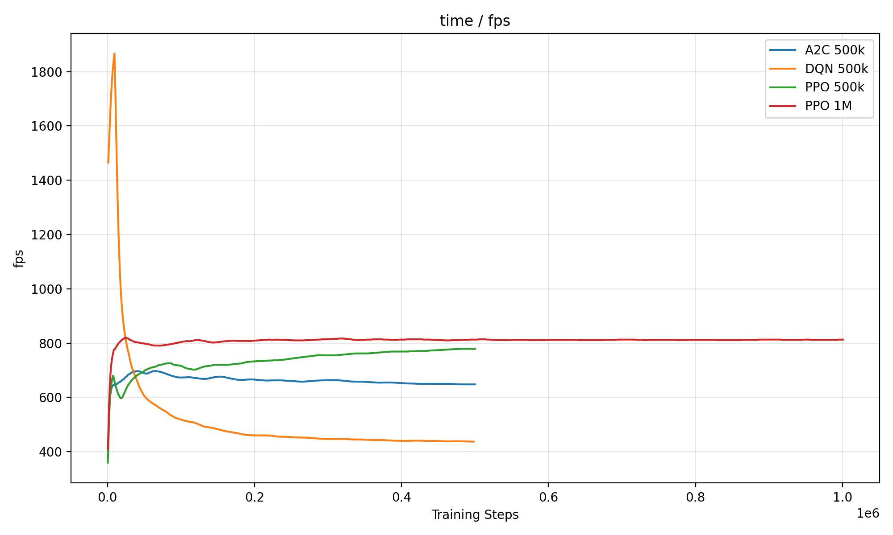

# 基于深度强化学习的 ViZDoom FPS 游戏智能体训练与评估

## 一、引言

### 1.1 研究背景

强化学习是一类面向序贯决策问题的机器学习方法，其核心思想是智能体通过与环境交互，不断根据奖励反馈调整自身策略，从而最大化长期累计回报。与监督学习依赖人工标注样本不同，强化学习中的智能体通常无法直接获得每一步的最优动作，而需要在试错过程中学习“什么行为会带来更好的长期结果”[1]。因此，强化学习特别适合研究游戏、机器人控制、自动驾驶和资源调度等需要连续决策的任务。

游戏环境长期以来都是强化学习研究的重要实验平台。其优势在于规则明确、反馈及时、实验可重复，同时又能够提供从简单控制到复杂规划的多层次挑战。DeepMind 提出的 DQN 在 Atari 游戏中实现了从像素输入到动作控制的端到端学习，证明了深度神经网络与强化学习结合后，可以在高维视觉输入任务中学习有效策略[2]。随后，A3C/A2C、PPO 等方法进一步提升了强化学习在游戏和连续控制任务中的稳定性与适用范围[3][4]。

ViZDoom 是一个基于经典第一人称射击游戏（First-Person-Shooter，FPS）Doom 构建的视觉强化学习研究平台，专门用于研究智能体如何从第一人称视角图像中学习控制策略[5]。与传统低维控制环境不同，ViZDoom 可以直接提供游戏画面作为观测输入，并支持射击、导航、生存、躲避等多种任务类型。官方环境中包含多个难度不同的场景，例如基础射击任务 DefendCenter，以及更复杂的 DeadlyCorridor 走廊战斗任务[6]。在 DefendCenter 场景中，智能体位于场景中心，主要任务是观察周围敌人并完成转向和射击。该任务目标清晰、动作需求相对简单，适合作为基础强化学习算法的对比实验。而在 DeadlyCorridor 场景中，智能体需要在敌人攻击下沿走廊前进，并最终到达目标位置。该任务同时包含导航、战斗、生存和探索，对智能体策略质量要求更高。尤其是在 DeadlyCorridor 中，智能体如果只会前进，可能短时间获得一定奖励，但并不具备真正的战斗能力；如果只会攻击，又无法完成推进目标。因此，该场景非常适合分析复杂强化学习任务中“奖励高”和“行为合理”之间的差异。

对于本课程而言，ViZDoom 的价值不仅在于它是一个游戏环境，更在于它能够完整体现强化学习中的关键问题：如何从视觉输入中学习策略，如何比较不同算法的表现，如何设计奖励函数，如何判断智能体是否真正学会任务，以及如何处理复杂环境中的探索困难和策略退化。通过 ViZDoom，可以将课堂中的强化学习理论与可观察、可复现的游戏智能体行为联系起来。

### 1.2 研究动机与问题

本研究以 ViZDoom 为 FPS 游戏仿真实验平台，围绕“训练强化学习智能体玩第一人称射击游戏”这一目标展开。研究并不只是训练单个模型，而是希望通过多个场景和多种方法，系统分析强化学习智能体在简单任务和复杂任务中的表现差异。

首先，在相对简单的 DefendCenter 场景中，本文比较随机策略（Random）、A2C、DQN 和 PPO 等方法，验证基础强化学习算法是否能够从视觉输入中学习射击策略。该部分实验用于回答：在目标明确、动作结构相对简单的 FPS 场景中，哪些强化学习方法更稳定、更有效？

随后，本文进一步研究更复杂的 DeadlyCorridor 场景。初步实验发现，默认环境下训练出的 PPO 模型虽然可以获得较高的原始奖励，但其行为并不一定合理。模型可能学会重复某个动作，例如持续前进，从而利用环境奖励机制获得较高分数，却没有真正学会转向、瞄准、射击和躲避。这类现象说明，在复杂强化学习任务中，单纯依赖数值奖励可能会误判智能体能力。奖励设计不当可能导致奖励投机现象，即智能体找到一种符合奖励函数但不符合人类预期目标的策略。奖励塑形虽然可以引导智能体学习更合理的行为，但其设计本身也需要谨慎，否则可能产生新的投机策略[7]。

针对 DeadlyCorridor 中暴露的问题，本文进一步尝试动作空间约束、奖励塑形和课程学习等方法。课程学习的基本思想是先从简单任务开始训练，再逐步过渡到更困难任务，从而降低探索难度。在 ViZDoom 中，这对应从低难度 skill 逐步训练到高难度 skill。然而实验也表明，对于复杂 FPS 场景，仅靠普通 PPO 和手工奖励设计仍难以稳定得到真正强策略。因此，本文进一步参考前人强基线方法，复现基于 SampleFactory 的 APPO+RNN 及其典型变体 LSTM、GRU 等模型。SampleFactory 通过高吞吐并行采样、循环记忆结构和组合动作空间，在三维视觉控制任务中表现出较强能力[9]，也更符合 FPS 游戏中同时移动、转向和攻击的实际控制方式。

### 1.3 本文主要工作

围绕上述研究目标，本文完成了以下工作：

1. 搭建 ViZDoom 强化学习实验环境，完成 PyTorch、Stable-Baselines3、SampleFactory 和 GPU 训练流程配置。

2. 在 DefendCenter 场景中实现并评估 Random、A2C、DQN 和 PPO 多种方法，比较不同强化学习算法在基础 FPS 视觉射击任务中的表现。

3. 保存训练模型、评估结果和高清视频，通过数值指标与视频行为相结合的方式分析智能体策略质量。

4. 在 DeadlyCorridor 场景中训练默认 PPO，并通过动作诊断和重复动作测试发现奖励投机问题，说明高原始奖励并不必然代表智能体真正会玩。

5. 针对 DeadlyCorridor 设计并实现多种改进尝试，包括动作空间约束、奖励塑形和课程学习，分析奖励尺度、动作空间和任务难度对策略行为的影响。

6. 调研并复现多个公开 SampleFactory DeadlyCorridor 强基线模型，对 APPO 模型进行统一评估和视频录制，比较不同训练规模、循环记忆结构和并行配置下的表现差异。

7. 从实验结果出发，总结复杂 FPS 强化学习任务中算法选择、奖励设计、动作空间、记忆结构和训练规模对最终策略质量的影响。

通过上述工作，本文不仅验证了 PPO、DQN、A2C 等方法在基础射击场景中的性能差异，也通过复杂场景实验和强基线复现分析了奖励机制、动作空间、循环记忆结构与并行训练规模对智能体行为的影响。结果表明，在复杂 FPS 任务中，数值奖励并不总能充分反映策略质量；因此，在复杂 FPS 场景中，模型评估应同时结合数值奖励、动作分布、环境变量和视频行为，而不能只依赖单一数值指标。

## 二、相关理论与方法

本章主要介绍本文实验中涉及的强化学习基础理论、典型深度强化学习算法以及在复杂 FPS 场景中使用的关键改进方法。由于本文的实验对象是 ViZDoom 这类视觉输入、离散动作、实时交互的游戏环境，因此本章重点围绕马尔可夫决策过程、DQN、A2C、PPO、APPO、循环神经网络、奖励塑形和课程学习展开。

### 2.1 强化学习基本框架

强化学习通常用于描述智能体与环境之间的序贯交互过程。在每一个时间步，智能体根据当前观测到的状态选择动作，环境在接收动作后转移到新的状态，并返回一个奖励信号。智能体的目标不是最大化某一步的即时奖励，而是在长期交互过程中学习一个能够最大化累计回报的策略。

强化学习问题通常可以建模为马尔可夫决策过程，记为：

\[
M=(S,A,P,R,\gamma)
\]

MathType 复制：

```latex
M=(S,A,P,R,\gamma)
```

其中，\(S\) 表示状态空间，\(A\) 表示动作空间，\(P\) 表示状态转移概率，\(R\) 表示奖励函数，\(\gamma\) 表示折扣因子。折扣因子用于衡量未来奖励在当前决策中的重要程度。当 \(\gamma\) 越接近 1 时，智能体越重视长期收益；当 \(\gamma\) 较小时，智能体更关注短期奖励。

在时间步 \(t\)，智能体处于状态 \(s_t\)，根据策略 \(\pi(a|s)\) 选择动作 \(a_t\)，环境返回奖励 \(r_t\) 并转移到下一状态 \(s_{t+1}\)。从某一时间步开始的累计折扣回报定义为：

\[
G_t=\sum_{k=0}^{\infty}\gamma^k r_{t+k}
\]

MathType 复制：

```latex
G_t=\sum_{k=0}^{\infty}\gamma^k r_{t+k}
```

强化学习的目标是寻找一个最优策略 \(\pi^*\)，使期望累计回报最大化：

\[
\pi^*=\arg\max_{\pi} \mathbb{E}_{\pi}\left[\sum_{t=0}^{\infty}\gamma^t r_t\right]
\]

MathType 复制：

```latex
\pi^*=\arg\max_{\pi} \mathbb{E}_{\pi}\left[\sum_{t=0}^{\infty}\gamma^t r_t\right]
```

在 ViZDoom 环境中，状态通常由游戏画面和部分游戏变量构成，例如血量、弹药、命中数等；动作对应游戏控制指令，例如转向、移动、射击等；奖励则来自击杀敌人、生存、前进或到达目标等事件。由于游戏画面属于高维视觉输入，传统表格型强化学习方法难以直接处理，因此本文采用深度神经网络近似价值函数或策略函数。

### 2.2 价值函数与策略函数

强化学习中常用价值函数衡量某个状态或状态-动作对的长期收益。状态价值函数定义为在状态 \(s\) 下按照策略 \(\pi\) 行动所能获得的期望回报：

\[
V^{\pi}(s)=\mathbb{E}_{\pi}[G_t|s_t=s]
\]

MathType 复制：

```latex
V^{\pi}(s)=\mathbb{E}_{\pi}[G_t|s_t=s]
```

动作价值函数表示在状态 \(s\) 下先执行动作 \(a\)，之后继续按照策略 \(\pi\) 行动所能获得的期望回报：

\[
Q^{\pi}(s,a)=\mathbb{E}_{\pi}[G_t|s_t=s,a_t=a]
\]

MathType 复制：

```latex
Q^{\pi}(s,a)=\mathbb{E}_{\pi}[G_t|s_t=s,a_t=a]
```

价值函数可以通过贝尔曼方程递推表示：

\[
Q^{\pi}(s,a)=\mathbb{E}\left[r+\gamma Q^{\pi}(s',a')\right]
\]

MathType 复制：

```latex
Q^{\pi}(s,a)=\mathbb{E}\left[r+\gamma Q^{\pi}(s',a')\right]
```

其中，\(s'\) 表示下一状态，\(a'\) 表示下一动作。价值函数方法通常通过估计 \(Q(s,a)\) 来选择动作，而策略梯度方法则直接优化策略 \(\pi(a|s)\)。本文使用的 DQN 属于典型价值函数方法，A2C、PPO 和 APPO 则属于策略优化或 actor-critic 方法。

### 2.3 DQN

DQN 是深度强化学习中的经典算法，其核心思想是使用深度神经网络近似动作价值函数 \(Q(s,a)\)。在传统 Q-learning 中，若状态和动作空间较小，可以用表格存储每个状态-动作对的价值；但在图像输入任务中，状态空间极大，无法直接使用表格方法。因此，DQN 使用神经网络 \(Q(s,a;\theta)\) 近似动作价值函数，其中 \(\theta\) 为网络参数。

DQN 的目标值通常写为：

\[
y=r+\gamma \max_{a'} Q(s',a';\theta^-)
\]

MathType 复制：

```latex
y=r+\gamma \max_{a'} Q(s',a';\theta^-)
```

其中，\(\theta^-\) 表示目标网络参数。DQN 通过最小化当前 Q 值与目标 Q 值之间的均方误差进行训练：

\[
L(\theta)=\mathbb{E}\left[\left(y-Q(s,a;\theta)\right)^2\right]
\]

MathType 复制：

```latex
L(\theta)=\mathbb{E}\left[\left(y-Q(s,a;\theta)\right)^2\right]
```

DQN 的两个关键机制是经验回放和目标网络。经验回放将智能体与环境交互得到的样本存储在 replay buffer 中，并在训练时随机采样，从而降低连续样本之间的相关性。目标网络则用于稳定训练目标，避免网络参数更新过快导致训练震荡。

在本文中，DQN 被用于 DefendCenter 场景，作为 value-based 方法的代表。实验结果表明，DQN 能够学习到一定的转向和射击策略，明显优于随机策略和 A2C，但其表现仍不如 PPO 稳定。

### 2.4 Actor-Critic 与 A2C

Actor-Critic 方法结合了策略函数和价值函数。Actor 负责输出动作策略，即在当前状态下选择各动作的概率；Critic 负责估计状态价值，用于评价 Actor 所选动作的好坏。与 DQN 只学习价值函数不同，Actor-Critic 直接学习策略，同时利用价值函数降低策略梯度估计的方差。

策略梯度方法的基本目标是最大化策略的期望回报：

\[
J(\theta)=\mathbb{E}_{\pi_{\theta}}[G_t]
\]

MathType 复制：

```latex
J(\theta)=\mathbb{E}_{\pi_{\theta}}[G_t]
```

其梯度可写为：

\[
\nabla_{\theta}J(\theta)=\mathbb{E}_{\pi_{\theta}}\left[\nabla_{\theta}\log \pi_{\theta}(a_t|s_t)A_t\right]
\]

MathType 复制：

```latex
\nabla_{\theta}J(\theta)=\mathbb{E}_{\pi_{\theta}}\left[\nabla_{\theta}\log \pi_{\theta}(a_t|s_t)A_t\right]
```

其中，\(A_t\) 是优势函数，用于衡量某个动作相对于当前状态平均水平的好坏。优势函数常用定义为：

\[
A(s_t,a_t)=Q(s_t,a_t)-V(s_t)
\]

MathType 复制：

```latex
A(s_t,a_t)=Q(s_t,a_t)-V(s_t)
```

A2C 可以看作 A3C 的同步版本。A3C 使用多个异步 worker 与环境交互并更新全局网络，而 A2C 则同步收集多个环境的经验后统一更新参数。A2C 在结构上较为清晰，能够同时学习策略和值函数，但在高维视觉输入和探索困难的任务中，其样本效率和稳定性可能不足。

在本文 DefendCenter 实验中，A2C 的表现仅略优于随机策略，说明在当前训练步数和环境设置下，A2C 未能充分学习到稳定的射击策略。

### 2.5 PPO

PPO 是本文实验中使用最重要的基础强化学习算法之一。它属于 policy gradient 方法，但相比普通策略梯度方法，PPO 通过限制每次策略更新的幅度，提高了训练稳定性。PPO 的核心思想是：新策略不能相对旧策略变化过大，否则可能导致训练崩溃或性能骤降。

PPO 使用新旧策略概率比：

\[
r_t(\theta)=\frac{\pi_{\theta}(a_t|s_t)}{\pi_{\theta_{old}}(a_t|s_t)}
\]

MathType 复制：

```latex
r_t(\theta)=\frac{\pi_{\theta}(a_t|s_t)}{\pi_{\theta_{old}}(a_t|s_t)}
```

其 clipped objective 可写为：

\[
L^{CLIP}(\theta)=\mathbb{E}_t\left[\min\left(r_t(\theta)A_t,\text{clip}(r_t(\theta),1-\epsilon,1+\epsilon)A_t\right)\right]
\]

MathType 复制：

```latex
L^{CLIP}(\theta)=\mathbb{E}_t\left[\min\left(r_t(\theta)A_t,\text{clip}(r_t(\theta),1-\epsilon,1+\epsilon)A_t\right)\right]
```

其中，\(\epsilon\) 是裁剪范围，通常取较小值。该目标函数的作用是，当新策略相对旧策略变化过大时，限制其收益，从而避免策略更新过度。

在本文实验中，PPO 在 DefendCenter 中表现最好，能够稳定学习转向和射击策略。但在 DeadlyCorridor 中，普通 PPO 暴露出明显局限：它可能根据环境原始奖励学习到重复前进等 reward shortcut，而不是形成真正合理的战斗策略。这说明 PPO 虽然训练稳定，但算法本身并不能保证策略行为符合人类预期，奖励函数、动作空间和环境结构同样会显著影响学习结果。

### 2.6 APPO、SampleFactory 与循环策略网络

APPO 可以理解为异步并行版本的 PPO。相比普通 PPO，APPO 更强调高吞吐采样和并行训练，适合复杂视觉环境中需要大量交互样本的任务。SampleFactory 是一个面向高效率强化学习训练的框架，它通过多个 worker 并行运行环境、收集经验并进行策略更新，从而显著提高训练吞吐量。

在复杂 FPS 环境中，仅依赖当前单帧图像往往不足以做出最优决策。例如，在 DeadlyCorridor 中，智能体需要记住自己刚才的移动方向、敌人位置、是否已经击杀某个敌人以及走廊结构。这类问题具有部分可观测性，因此循环神经网络可以发挥重要作用。

循环策略网络可以表示为：

\[
h_t=f_{\theta}(o_t,h_{t-1})
\]

MathType 复制：

```latex
h_t=f_{\theta}(o_t,h_{t-1})
```

其中，\(o_t\) 表示当前观测，\(h_{t-1}\) 表示上一时刻的隐藏状态，\(h_t\) 表示当前隐藏状态。策略输出可以进一步表示为：

\[
a_t \sim \pi_{\theta}(a_t|o_t,h_t)
\]

MathType 复制：

```latex
a_t \sim \pi_{\theta}(a_t|o_t,h_t)
```

本文复现的 SampleFactory 强基线模型采用 APPO+RNN 结构，其中 RNN 的具体形式包括 GRU 和 LSTM。GRU 和 LSTM 都可以保留历史信息，帮助智能体在部分可观测环境中进行决策。对于 DeadlyCorridor 这类任务，RNN 能够帮助智能体利用过去几帧的信息判断敌人位置、移动趋势和自身状态。

此外，SampleFactory 使用组合动作空间。普通离散动作空间通常每一步只能选择一个动作，例如“前进”或“攻击”；而 FPS 游戏中的真实玩家往往会同时完成多个动作，例如一边前进、一边转向、一边射击。组合动作空间可以让智能体同时选择移动、转向、平移和攻击，因此更符合 FPS 控制方式，也更容易形成自然的战斗行为。

### 2.7 奖励塑形

奖励函数是强化学习中非常关键的部分。智能体学习的目标由奖励函数定义，因此奖励设计会直接影响最终策略。Reward shaping，即奖励塑形，是指在环境原始奖励之外加入额外奖励或惩罚，用于引导智能体更快学习期望行为。

一般而言，塑形后的奖励可以写为：

\[
r'_t=r_t+F(s_t,a_t,s_{t+1})
\]

MathType 复制：

```latex
r'_t=r_t+F(s_t,a_t,s_{t+1})
```

其中，\(r_t\) 是环境原始奖励，\(F(s_t,a_t,s_{t+1})\) 是额外设计的塑形奖励项。

在 DeadlyCorridor 中，本文曾尝试使用如下形式的奖励设计：

\[
r_{shaped}=c_{raw}r_{raw}+c_d\Delta damage+c_h\Delta hit-c_{health}\Delta health-c_a I_{attack}-c_{death}I_{death}
\]

MathType 复制：

```latex
r_{shaped}=c_{raw}r_{raw}+c_d\Delta damage+c_h\Delta hit-c_{health}\Delta health-c_a I_{attack}-c_{death}I_{death}
```

其中，\(r_{raw}\) 表示环境原始奖励，\(\Delta damage\) 表示造成伤害的增量，\(\Delta hit\) 表示命中数增量，\(\Delta health\) 表示血量损失，\(I_{attack}\) 表示是否攻击，\(I_{death}\) 表示是否死亡。该奖励函数的设计目标是降低原始推进奖励的主导作用，同时鼓励命中敌人、造成伤害并减少无意义掉血。

但是，奖励塑形并不总是可靠。如果某个奖励项权重过大，智能体可能会学习到新的投机策略。例如，若原始推进奖励权重过大，智能体可能只学会持续前进；若攻击奖励设计不当，智能体可能频繁无意义开枪。因此，在复杂环境中，奖励塑形需要与动作分布、环境变量和视频行为结合分析，不能只依据最终奖励值判断效果。

### 2.8 课程学习

课程学习的基本思想是先从较简单的任务开始训练，再逐步增加任务难度。对于强化学习而言，课程学习可以降低早期探索难度，使智能体先掌握基础行为，再逐步迁移到复杂任务中。

课程学习过程可以抽象表示为一组难度逐渐增加的任务序列：

\[
\mathcal{T}_1 \rightarrow \mathcal{T}_2 \rightarrow \cdots \rightarrow \mathcal{T}_n
\]

MathType 复制：

```latex
\mathcal{T}_1 \rightarrow \mathcal{T}_2 \rightarrow \cdots \rightarrow \mathcal{T}_n
```

在本文的 DeadlyCorridor 实验中，课程学习对应 ViZDoom 中从低难度 skill 到高难度 skill 的训练过程：

\[
skill\ 1 \rightarrow skill\ 2 \rightarrow skill\ 3 \rightarrow skill\ 4 \rightarrow skill\ 5
\]

MathType 复制：

```latex
skill\ 1 \rightarrow skill\ 2 \rightarrow skill\ 3 \rightarrow skill\ 4 \rightarrow skill\ 5
```

该设计的目标是让智能体先在敌人较弱、任务较简单的环境中学习移动和攻击，再逐渐适应更高难度的走廊战斗。然而实验结果表明，课程学习虽然可以改善部分行为，但并不能单独解决 DeadlyCorridor 的全部问题。在普通 PPO 和单一离散动作空间下，模型仍然可能出现卡路口、硬冲或重复动作等现象。这说明复杂 FPS 任务不仅需要合理的训练顺序，还需要合适的动作空间、记忆结构和足够大的训练规模。

### 2.9 本章小结

本章介绍了本文实验涉及的主要强化学习理论与方法。DQN 通过近似动作价值函数解决离散动作决策问题，A2C 采用 actor-critic 结构同时学习策略和值函数，PPO 通过限制策略更新幅度提高训练稳定性。对于 DeadlyCorridor 这类复杂 FPS 场景，普通 PPO 容易受到奖励设计和动作空间限制的影响，因此本文进一步关注 APPO、循环策略网络、组合动作空间、奖励塑形和课程学习等方法。

这些理论和方法共同构成了本文后续实验的基础。DefendCenter 实验主要用于比较基础算法在简单射击任务中的表现，而 DeadlyCorridor 实验则用于分析复杂环境下奖励设计、动作空间和策略结构对智能体行为质量的影响。

## 四、DefendCenter 基础实验：多算法对比

本章围绕 ViZDoom 中的 DefendCenter 场景展开基础强化学习实验。该场景中，智能体位于场景中心，敌人会从多个方向不断出现并靠近智能体。智能体的主要任务是根据视觉输入判断敌人方向，及时转向并射击敌人。相比后续 DeadlyCorridor 场景，DefendCenter 不涉及复杂导航和路径规划，任务目标更加明确，因此适合作为基础强化学习算法对比实验。

本章实验从三个角度评价不同方法的表现：第一，利用 TensorBoard 训练曲线观察模型在训练过程中的学习趋势；第二，通过固定评估局数统计平均奖励、标准差、最低分和最高分；第三，通过高清视频观察智能体是否真正学会转向和射击行为。

### 4.1 实验目的

DefendCenter 实验的主要目的有三个。

首先，验证本文搭建的 ViZDoom 强化学习训练流程是否有效。如果智能体能够在 DefendCenter 中从视觉输入学习转向和射击策略，说明环境封装、图像输入、模型训练、评估脚本和视频录制流程基本可用。

其次，比较不同强化学习方法在简单 FPS 视觉射击任务中的表现。本文选取 Random、A2C、DQN 和 PPO 作为对比方法。其中 Random 作为无学习基线，A2C 代表 actor-critic 方法，DQN 代表基于值函数的方法，PPO 代表稳定性较强的策略梯度方法。

最后，分析训练步数对 PPO 表现的影响。本文不仅训练 PPO-500k，还进一步训练 PPO-1M，用于观察增加训练步数是否能够继续提升性能。

### 4.2 实验设置

本文在 DefendCenter 场景中设置了五组实验。Random 策略不进行训练，仅随机选择动作；A2C、DQN 和 PPO 使用 Stable-Baselines3 实现，并在相同环境下完成训练和评估。

**表 2 DefendCenter 场景中实验设置**

| 方法 | 训练步数 | 说明 |
|---|---:|---|
| Random | 0 | 随机选择动作，作为无学习基线 |
| A2C | 500k | 同步 actor-critic 方法 |
| DQN | 500k | 基于动作价值函数的方法 |
| PPO | 500k | 基础 PPO 模型 |
| PPO | 1M | 延长训练步数后的 PPO 模型 |

训练过程中，使用 TensorBoard 记录 `rollout/ep_rew_mean`、`rollout/ep_len_mean`、`time/fps` 以及部分算法相关的训练指标。训练完成后，每个模型使用统一评估脚本进行测试，并录制视频用于行为分析。

### 4.3 训练平均奖励曲线分析

图 3 展示了 A2C-500k、DQN-500k、PPO-500k 和 PPO-1M 在 DefendCenter 训练过程中的平均回合奖励变化。该指标反映智能体在训练过程中每个回合能够获得的平均奖励，因此可以直观观察不同算法的学习速度和最终策略水平。



**图 3 DefendCenter 不同方法训练过程中的平均回合奖励曲线**

从整体趋势看，A2C 的 reward 曲线始终处于较低水平，训练到 500k 步后平均奖励仍然不足 1。曲线虽然相比初始阶段略有上升，但是提升幅度很小，说明 A2C 在该视觉射击任务中没有形成有效策略。结合 DefendCenter 的任务特点可以看出，智能体需要根据画面中敌人的方向持续转向并射击，而 A2C 在有限训练步数下没有充分学习到这种稳定的视觉-动作映射。

DQN 的奖励曲线明显高于 A2C，并随着训练步数增加逐渐上升，说明 DQN 能够通过动作价值函数学习到一定的射击策略。DQN 在训练后期平均奖励达到 10 以上，表明它已经能够在部分局中有效击杀敌人。但与 PPO 相比，DQN 的曲线上升速度较慢，最终水平也明显更低。这说明虽然 DefendCenter 的离散动作空间适合 DQN 学习，但 DQN 对视觉输入下的策略优化效率仍不如 PPO。

PPO-500k 的学习曲线表现最突出。训练前期奖励从接近 0 开始快速上升，中期后逐渐达到较高水平，并在 500k 步附近稳定到约 20 左右。这说明 PPO 在该任务中具有较好的样本利用效率和训练稳定性，能够较快学习到“观察敌人方向、转向、射击”的核心策略。

PPO-1M 的曲线进一步说明了强化学习训练过程的不稳定性。虽然 PPO-1M 在训练后期也达到较高奖励，甚至曲线末端略高于 PPO-500k，但其中间阶段存在明显下降和波动。这种现象说明，延长训练步数并不必然带来单调提升。策略在训练过程中可能由于采样随机性、策略更新幅度、环境随机性等因素发生退化或波动。因此，模型选择不能只看训练曲线末端数值，还需要结合独立评估结果和视频行为进行判断。

综合图 3 可以看出，在 DefendCenter 场景中，PPO 的学习能力明显优于 A2C 和 DQN；PPO-500k 已经能够达到较高水平，而继续训练到 1M 虽然保持高奖励，但稳定性并未进一步提升。

### 4.4 回合长度曲线分析

图 4 展示了不同方法在训练过程中平均回合长度的变化。回合长度反映智能体在单局游戏中能够持续存活和行动的时间。在 DefendCenter 场景中，回合长度越长，通常说明智能体能够更有效地防守敌人，从而避免过早失败。



**图 4 DefendCenter 不同方法训练过程中的平均回合长度曲线**

A2C 的回合长度曲线整体较低，训练到 500k 步后仍然只在 300 左右波动。结合图 3 中 A2C 的低奖励可以看出，A2C 没有学到有效的击杀策略，因此既无法获得高奖励，也无法显著延长生存时间。其回合长度的轻微提升更可能来自偶然击杀或局部行为改善，而不是稳定策略形成。

DQN 的回合长度明显高于 A2C，并随着训练过程逐渐上升。该现象与 DQN 奖励曲线的提升相对应，说明 DQN 不仅能够获得更高奖励，也确实通过击杀敌人延长了回合持续时间。也就是说，DQN 的奖励提升并不是偶然获得的，而是伴随实际防守能力增强。

PPO-500k 的回合长度曲线提升最明显，训练中后期接近或超过 1000。这说明 PPO 学到的策略能够显著延长游戏时间。由于 DefendCenter 中敌人会不断出现，智能体只有持续正确转向和射击，才能在环境中维持较长回合长度。因此，回合长度的提升从另一个角度证明了 PPO 策略能力的增强。

PPO-1M 的回合长度整体也处于较高水平，但与奖励曲线类似，中间阶段存在明显波动和下降。这表明训练更久后，策略并非始终保持稳定提升，而可能出现阶段性退化。值得注意的是，PPO-1M 末端回合长度较高，但最终独立评估中其标准差更大、最低分更低，说明训练曲线上的高回合长度并不能完全代表模型在评估中的稳定性。

综合图 4 可以发现，回合长度曲线与 reward 曲线基本一致：A2C 最弱，DQN 有一定提升，PPO 最强。这说明奖励的提升与实际生存能力提升是相互对应的，PPO 在 DefendCenter 中不仅分数高，而且确实能更长时间维持有效防守。

### 4.5 训练速度曲线分析

图 5 展示了不同方法训练过程中的每秒处理帧数（Frames-Per-Second，FPS）曲线，即单位时间内环境交互和训练处理的速度。该指标主要反映训练效率，而不是策略质量。



**图 5 DefendCenter 不同方法训练过程中的 FPS 曲线**

从图中可以看出，不同算法的 FPS 存在明显差异。DQN 在训练初期 FPS 较高，但随着训练进行，其 FPS 有明显下降。这可能与经验回放缓冲区逐渐填充、网络更新频率增加以及训练过程中的采样和优化开销有关。虽然 DQN 训练速度在前期较高，但最终奖励仍低于 PPO，说明训练吞吐量高并不必然意味着策略效果更好。

A2C 的 FPS 相对稳定，整体训练速度并不低，但从奖励和回合长度曲线看，A2C 的最终学习效果较弱。这进一步说明，训练速度只能衡量计算效率，不能直接衡量学习质量。一个算法即使能够快速采样，如果策略更新效率低或难以从视觉输入中提取有效信息，最终仍可能表现较差。

PPO-500k 和 PPO-1M 的 FPS 曲线整体较稳定，并且在后期保持较高水平。PPO 的训练需要进行策略更新、价值函数估计和优势函数计算，单步训练机制比简单采样更复杂，但从结果看，其额外计算开销换来了更好的策略质量。也就是说，在 DefendCenter 任务中，PPO 在训练效率和最终性能之间取得了较好的平衡。

PPO-1M 的 FPS 曲线较长且后期稳定，说明从工程实现角度看，本文的训练流程能够支持较长时间训练，没有出现明显性能崩溃或速度异常下降。但结合最终评估结果，PPO-1M 并没有明显超过 PPO-500k，说明在该任务中，增加训练时间主要带来更高计算成本，而不一定带来更高收益。

因此，图 5 的主要结论是：训练速度是实验效率的重要指标，但不能单独作为算法优劣依据。A2C 和 DQN 在部分阶段具有较高 FPS，但最终策略质量不如 PPO；PPO 虽然训练过程更复杂，但在奖励、回合长度和视频行为上表现最好。因此，本文后续选择模型时更重视综合性能，而不是单纯训练速度。

### 4.6 最终评估结果

训练曲线能够反映模型在训练过程中的学习趋势，但由于强化学习训练本身具有随机性，TensorBoard 中的 rollout 指标并不能完全等价于最终模型的实际表现。因此，本文在训练完成后使用统一评估脚本对各模型进行独立测试，并统计平均奖励、标准差、最低分和最高分。最终评估结果如表 3 所示。

**表 3 DefendCenter 场景中各实验训练模型评估结果**

| 方法 | 训练步数 | 评估局数 | 平均奖励 | 标准差 | 最低分 | 最高分 |
|---|---:|---:|---:|---:|---:|---:|
| Random | 0 | 20 | 0.20 | 0.98 | -1 | 3 |
| A2C | 500k | 20 | 0.90 | 0.70 | 0 | 3 |
| DQN | 500k | 20 | 11.35 | 4.56 | 5 | 19 |
| PPO | 500k | 20 | 21.20 | 2.82 | 12 | 25 |
| PPO | 1M | 20 | 21.15 | 6.13 | 5 | 25 |

从平均奖励来看，Random 策略仅达到 0.20，说明在 DefendCenter 场景中随机动作几乎无法形成有效防守。虽然该场景相比 DeadlyCorridor 简单，但智能体仍需要根据视觉输入判断敌人方向，并选择合适的转向和射击动作。因此，随机策略无法稳定击杀敌人，平均奖励接近 0 是符合预期的。

A2C-500k 的平均奖励为 0.90，只比 Random 略高。从标准差和最高分看，A2C 的最高分仅为 3，说明它偶尔能够获得少量奖励，但整体没有形成稳定策略。结合训练曲线可以看出，A2C 在训练过程中 reward 提升幅度很小，最终评估结果也验证了这一点。这说明在本文的训练设置下，A2C 对 DefendCenter 这种视觉输入任务的样本利用效率不足。

DQN-500k 的平均奖励达到 11.35，明显高于 Random 和 A2C，最低分为 5，最高分达到 19。这说明 DQN 已经学会了一定的射击策略，且并不是只在个别局中偶然得分。DQN 的标准差为 4.56，说明其表现存在一定波动：在部分局中能够较好地击杀敌人，但在敌人出现方向变化较快或局面更复杂时，仍可能出现反应不及时的问题。

PPO-500k 是本组实验中表现最好的模型，平均奖励达到 21.20，最高分达到 25，说明其已经能够在部分 episode 中达到满分。更重要的是，PPO-500k 的最低分为 12，明显高于其他方法，这表明它不仅平均表现高，而且在较差情况下也能保持一定防守能力。标准差为 2.82，也低于 DQN 和 PPO-1M，说明 PPO-500k 的策略稳定性最好。

PPO-1M 的平均奖励为 21.15，与 PPO-500k 非常接近，最高分同样达到 25。然而，PPO-1M 的标准差增大到 6.13，最低分下降到 5。这说明 PPO-1M 虽然仍然能够在部分局中表现很好，但整体稳定性不如 PPO-500k。该结果与训练曲线中的中途波动相一致，说明延长训练步数并不必然带来更优策略。在强化学习中，策略更新受到采样随机性、环境随机性和优化过程影响，训练更久可能导致策略出现阶段性退化或过拟合于某些状态分布。

综合最终评估结果可以得出，DefendCenter 场景中 PPO-500k 在平均奖励、最低分和稳定性方面综合最优。DQN 能够学到有效策略，但与 PPO 仍有明显差距；A2C 在该任务中表现接近随机策略。最终结果与 TensorBoard 训练曲线基本一致，进一步验证了 PPO 在该基础 FPS 视觉射击任务中的优势。

### 4.7 视频行为分析

数值奖励能够反映模型表现，但在游戏强化学习任务中，仅依赖奖励值仍然不够。因为奖励只能说明智能体在环境定义的评价标准下获得了多少分，却不能直接说明智能体采取了怎样的行为。为了确认模型是否真正学会了 DefendCenter 的核心策略，本文对不同方法录制了高清视频，并结合视频观察其行为差异。

Random 策略的视频表现最差。智能体在场景中没有稳定目标，转向和射击都呈现随机性。它既不能持续跟踪敌人方向，也无法在敌人靠近前做出有效攻击。因此，Random 偶尔能够击中敌人，但更多时候是在无意义转向或射击。这与其平均奖励接近 0 的结果一致。

A2C 的视频表现相比 Random 略有改善，但整体仍然缺乏稳定策略。智能体有时会朝敌人方向转动或射击，但这种行为不连续，也不能稳定应对敌人从不同方向出现的情况。当敌人数量增加或方向变化较快时，A2C 很容易失去目标，导致敌人接近并结束回合。这说明 A2C 虽然经过训练，但没有形成可靠的视觉识别和动作选择能力。

DQN 的视频表现明显优于 Random 和 A2C。智能体能够在一定程度上根据敌人位置调整方向，并在敌人进入视野后进行射击。尤其在敌人出现方向较明确时，DQN 能够较快做出反应并获得奖励。然而，DQN 的问题在于策略稳定性不足。当场景中敌人从多个方向接近时，DQN 有时会转向不及时，或者射击节奏不够稳定，导致漏掉部分敌人。因此，DQN 虽然已经学会了基本射击行为，但还没有达到最优防守水平。

PPO-500k 的视频表现最接近理想策略。智能体能够持续观察敌人方向，并根据敌人位置快速转向，在敌人靠近前完成射击。与 DQN 相比，PPO 的转向和射击更连贯，行为更稳定。在高分回合中，PPO-500k 能够长时间维持防守状态，并连续消灭多个方向出现的敌人，说明它已经掌握了 DefendCenter 的核心任务逻辑。

PPO-1M 的视频中也可以观察到较强的转向和射击能力，但其表现不如 PPO-500k 稳定。部分回合中，PPO-1M 能够取得满分；但在另一些回合中，它会出现反应变慢、转向不够及时或射击选择不稳定的情况。这与评估结果中 PPO-1M 标准差较大、最低分下降相一致。

通过视频分析可以看出，最终评估结果并不是偶然数值差异，而是对应真实行为质量差异。Random 和 A2C 缺乏稳定策略，DQN 具备基本射击能力，PPO-500k 则能够稳定完成转向、瞄准和射击。因此，视频行为进一步证明 PPO-500k 是 DefendCenter 场景中综合表现最好的模型。

### 4.8 本章小结

本章在 ViZDoom DefendCenter 场景中完成了基础强化学习算法对比实验，并从训练曲线、最终评估和视频行为三个角度分析了 Random、A2C、DQN 和 PPO 的表现。

首先，从 TensorBoard 训练曲线看，A2C 的平均奖励和回合长度长期处于较低水平，说明其在该任务中学习效果有限；DQN 的平均奖励和回合长度均随训练提升，说明其能够学到一定射击策略；PPO 的提升最明显，尤其 PPO-500k 在训练中后期达到较高奖励和较长回合长度，表现出更强的学习能力。训练速度曲线进一步说明，训练效率和最终策略质量并不完全一致，A2C 和 DQN 在部分阶段具有较高 FPS，但最终效果不如 PPO。

其次，从最终评估结果看，Random 平均奖励仅为 0.20，A2C-500k 平均奖励为 0.90，DQN-500k 提升到 11.35，而 PPO-500k 达到 21.20，取得最优表现。PPO-1M 的平均奖励与 PPO-500k 接近，但标准差更大、最低分更低，说明继续训练并没有带来稳定收益。综合平均奖励、标准差、最低分和最高分，PPO-500k 是 DefendCenter 中最优模型。

最后，从视频行为看，PPO-500k 不仅数值表现最好，而且确实学会了符合任务目标的行为。它能够根据敌人方向持续转向，并在敌人靠近前完成射击。相比之下，Random 和 A2C 缺乏稳定策略，DQN 虽然能够学习基本射击行为，但稳定性和连续防守能力不如 PPO。

因此，DefendCenter 实验证明，PPO 在目标明确、动作结构相对简单的 FPS 视觉射击任务中具有较好的稳定性和表现。这一结果也为后续 DeadlyCorridor 复杂环境实验提供了重要基础：虽然 PPO 能够在简单场景中稳定学会射击策略，但在更复杂的走廊战斗任务中，智能体还需要同时处理导航、躲避、生存和攻击等问题。下一章将进一步分析 PPO 在 DeadlyCorridor 中遇到的奖励投机行为和策略退化问题。
